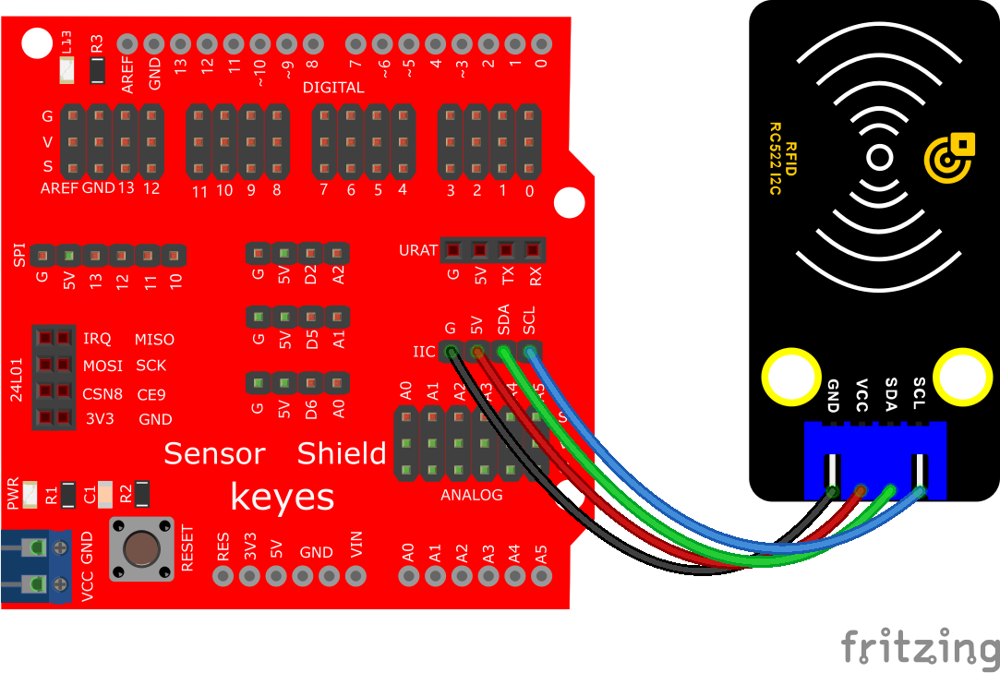

# Arduino


## 1. Arduino简介  

Arduino是一款开源电子原型平台，包含易于使用的软件和硬件，主要用于开发互动项目。Arduino开发板基于易于理解的微控制器，配合Arduino IDE，支持用户通过C/C++语言编程，创建各种应用。由于其简单易用的特性，它受到许多电子爱好者和开发者的喜爱，广泛应用于教育、艺术及科技项目。  

Arduino的强大之处在于其丰富的社区和库支持，让用户能够方便地借用现成的代码和硬件模块。通过Arduino，用户可以轻松地使用不同传感器（如温度、光线、运动等）、显示器、马达和其他组件来实现自己的创意和想法。Arduino不仅适合初学者，也成为专业开发者开发原型和产品的重要工具。  

## 2. 接线图  

  

## 3. 测试代码  

```cpp  
#include <Wire.h>  
#include "MFRC522_I2C.h"  

// 0x28 是 SDA 上的 i2c 地址。如果不匹配，请使用 i2cscanner检查您的地址  
MFRC522 mfrc522(0x28); // 创建 MFRC522 实例。  

String rfid_str = "";  

void setup() {  
    Serial.begin(115200); // 设置波特率为115200  
    Wire.begin(); // 初始化 I2C  
    mfrc522.PCD_Init(); // 初始化 MFRC522  
}  

void loop() {  
    if (!mfrc522.PICC_IsNewCardPresent() || !mfrc522.PICC_ReadCardSerial()) {  
        delay(50);  
        return;  
    }  

    rfid_str = ""; // 字符串清空  
    Serial.print(F("Card UID: "));  

    for (byte i = 0; i < mfrc522.uid.size; i++) { // 转储 UID  
        rfid_str = rfid_str + String(mfrc522.uid.uidByte[i], HEX); // 转为字符串  
    }  

    Serial.println(rfid_str);  
}  
```  

## 4. 代码说明  

### 4.1 导入库文件  
首先，导入RFID522的库文件：`#include "MFRC522_I2C.h"`，以确保可以使用RFID功能。  

### 4.2 I2C初始化  
使用`Wire.begin();`进行I2C初始化，因为此模块是IIC接口的。  

### 4.3 RFID模块初始化  
通过`mfrc522.PCD_Init();`来初始化MFRC522模块，以做好后续读取准备。  

### 4.4 读取卡片  
在`loop()`函数中，使用`mfrc522.PICC_IsNewCardPresent()`和`mfrc522.PICC_ReadCardSerial()`来检测和读取IC卡的信息。若成功读取卡片，将UID打印到串口监视器。  

### 4.5 字符串处理  
通过`String(mfrc522.uid.uidByte[i], HEX);`将读取到的UID转为16进制格式的字符串进行输出。  

## 5. 测试结果  

将代码烧录到Arduino，按照接线图连接好线路，上电并打开串口监视器，设置波特率为115200。当IC卡或钥匙扣靠近RFID模块时，模块将成功读取到信息，打印在串口监视器上，示例结果如下图所示。  


