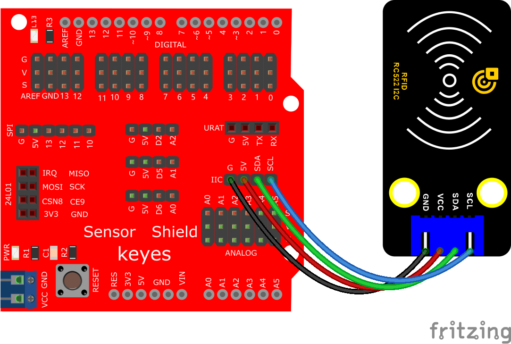
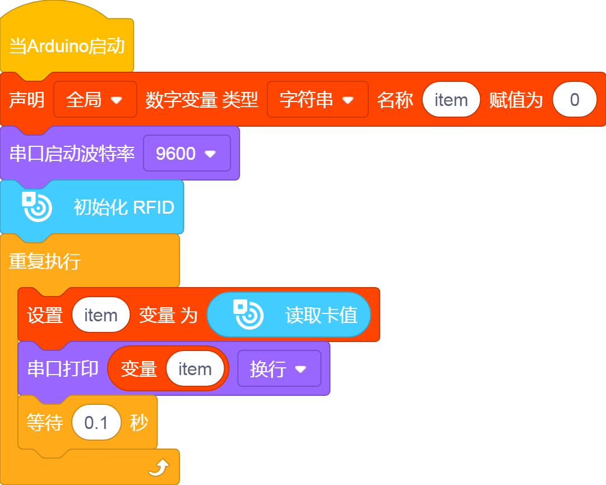
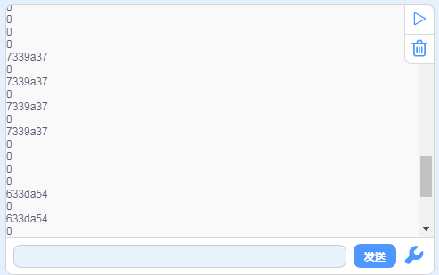

# KidsBlock

## 1. KidsBlock简介  

KidsBlock是一款专为儿童和初学者设计的可视化编程工具，旨在通过简单直接的图形化界面来提高用户的编程兴趣和创造力。它采用模块化的编程方式，让用户通过拖放积木来创建程序，从而生动直观地理解编程逻辑和基本概念。KidsBlock支持多个编程平台，用户可以在Arduino、Raspberry Pi等硬件上进行编程和项目开发。  

该工具包含大量的示例和教程，并提供了与真实硬件的互动，帮助用户实现从简单到复杂的项目。KidsBlock强调动手实践，让学习编程不再枯燥，推动孩子们在项目中发挥他们的创造性思维和解决问题的能力。  

## 2. 接线图  

  

## 3. 测试代码  

  

## 4. 代码说明  

### 4.1 声明变量  
首先，我们需要声明一个字符串变量`str`，用于存储从RFID模块读取的数据。  

  

### 4.2 初始化模块  
接下来，通过初始化RFID模块和启动串口监视器来准备后续的数据读取。  

  

### 4.3 数据读取  
读取到的数据将被赋值给之前定义的变量`item`。如果没有刷卡，字符串将保持为“0”。  

  

## 5. 测试结果  

成功烧录测试代码并完成接线后，上电并打开串口监视器。扫描IC卡或钥匙扣后，RFID模块能成功读取并打印出相关信息，输出的结果示例如下图所示。  

