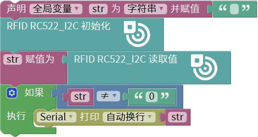
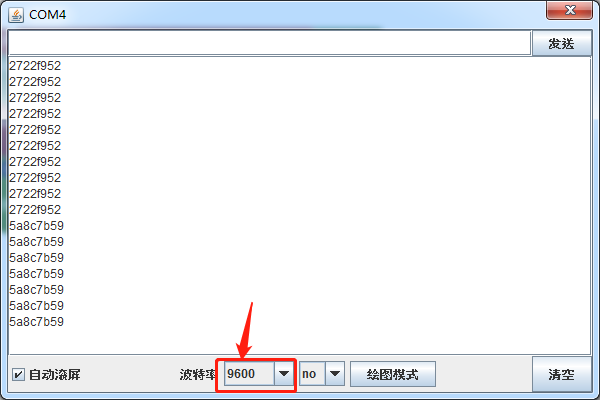

# Mixly

## 1. Mixly简介  

Mixly是一款面向儿童和初学者的可视化编程工具，旨在通过简单图形化的积木编程方式，提高用户的编程兴趣和创造力。它允许用户通过拖放块状代码来创建程序，从而简化了编程的复杂性，尤其适合教育和入门学习。Mixly支持多种硬件平台，包括Arduino、Raspberry Pi等，使用范围广泛。  

Mixly提供了友好的用户界面和丰富的编程模块，用户可以轻松实现不同的功能和项目。同时，它还支持代码的导出，以供进一步在其他编程环境中使用，促进了学生在编程项目中的实践和探索。通过与真实硬件的互动，Mixly让学习编程变得生动有趣，激发了学生的逻辑思维和解决问题的能力。  

## 2. 接线图  

  

## 3. 测试代码  

  

## 4. 代码说明  

### 4.1 声明变量  
首先，我们需要声明一个字符串变量`str`，用于储存从RFID模块读取的数据。  

  

### 4.2 初始化RFID模块  
接下来，通过初始化RFID模块准备后续的数据读取。  

  

### 4.3 数据读取  
读取的数据将被赋值给之前定义的变量`str`。如果没有刷卡，字符串将保持为“0”，此时不打印信息。  

  

## 5. 测试结果  

成功烧录测试代码并按照接线图连接好线路后，上电并打开串口监视器，设置波特率为9600。当IC卡或钥匙扣靠近RFID模块时，模块将成功读取并打印相关信息，如下图所示。  

